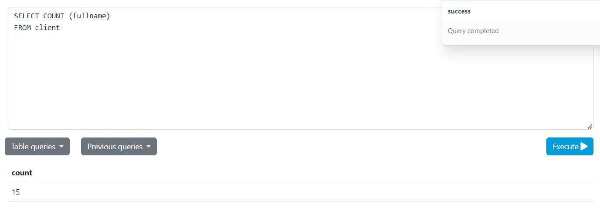
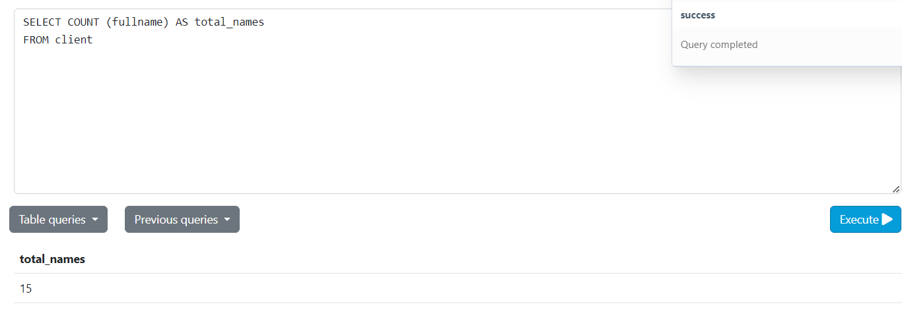
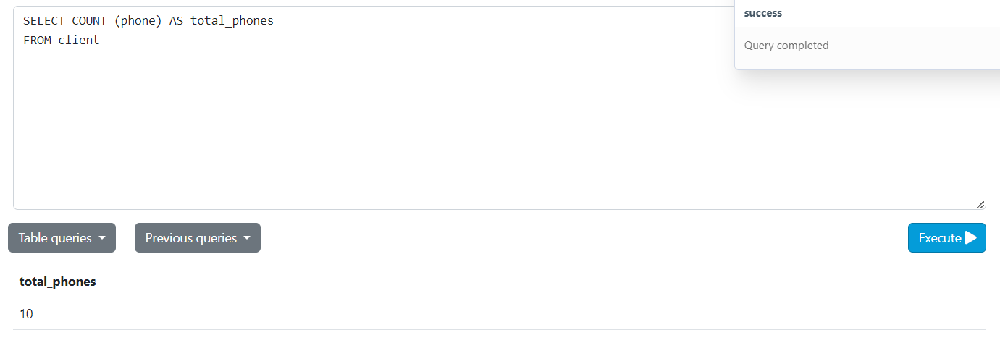
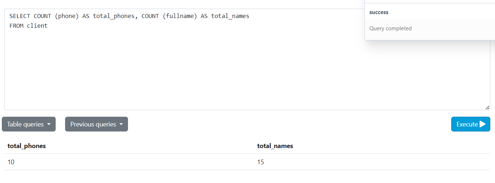
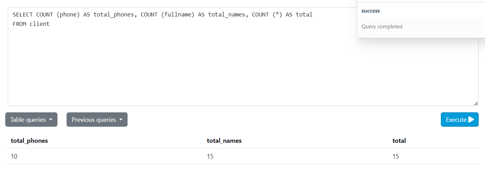
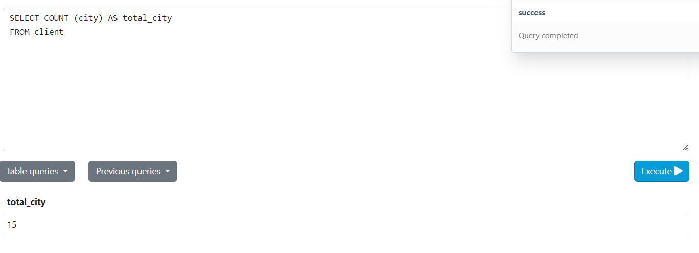
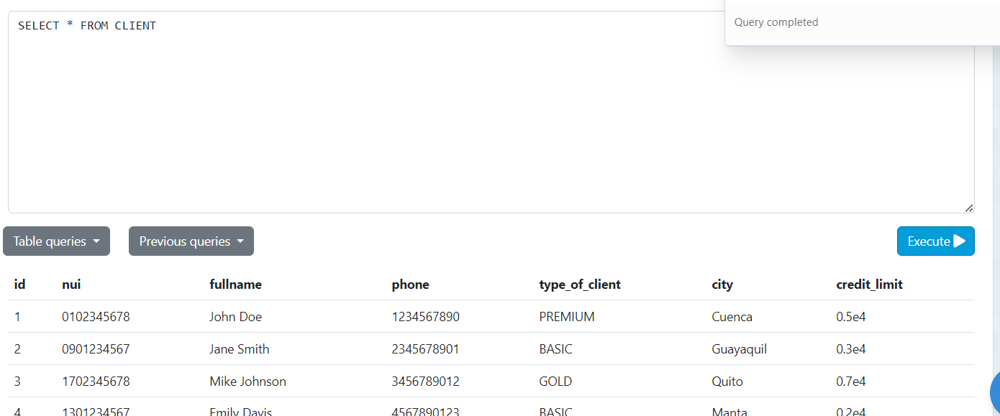
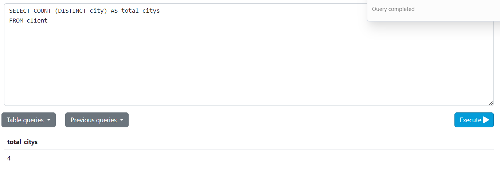

# Tarea en clase Semana 8
## La función count
### Creación de la tabla
El siguiente código crea la tabla *client*
```
CREATE TABLE client (
id SERIAL,
nui VARCHAR (10) NOT NULL,
fullname VARCHAR (100) NOT NULL,
phone VARCHAR (10),
type_of_client VARCHAR (50) DEFAULT 'BASIC',
city VARCHAR (50),
credit_Limit DECIMAL(7,2)
);
```


### Inserción de datos
Text text text
```
    INSERT INTO client (nui, fullname, phone, type_of_client, city, credit_Limit)
    VALUES
    ('0102345678', 'John Doe', '1234567890', 'PREMIUM', 'Cuenca', 5000.00),
    ('0901234567', 'Jane Smith', '2345678901', 'BASIC', 'Guayaquil', 3000.00),
    ('1702345678', 'Mike Johnson', '3456789012', 'GOLD', 'Quito', 7000.00),
    ('1301234567', 'Emily Davis', '4567890123', 'BASIC', 'Manta', 2000.00),
    ('0103456789', 'David Brown', '5678901234', 'SILVER', 'Cuenca', 4500.00),
    ('0902345678', 'Sophia Wilson', '6789012345', 'BASIC', 'Guayaquil', 3500.00),
    ('1703456789', 'James Martinez', '7890123456', 'PLATINUM', 'Quito', 8000.00),
    ('1302345678', 'Linda Anderson', '8901234567', 'BASIC', 'Manta', 2500.00),
    ('0104567890', 'Robert Thomas', '9012345678', 'DIAMOND', 'Cuenca', 10000.00),
    ('0903456789', 'Patricia Jackson', '0123456789', 'BASIC', 'Guayaquil', 4000.00);

```
### Cinco valores más en nulo
```
    INSERT INTO client (nui, fullname, phone, type_of_client, city, credit_Limit)
    VALUES
    ('0112345678', 'Carlos Perez', NULL, 'PREMIUM', 'Cuenca', 6000.00),
    ('0912345678', 'Ana Gomez', NULL, 'BASIC', 'Guayaquil', 3200.00),
    ('1712345678', 'Luis Morales', NULL, 'GOLD', 'Quito', 7100.00),
    ('1312345678', 'Marta Torres', NULL, 'BASIC', 'Manta', 2300.00),
    ('0113456789', 'Jorge Ramirez', NULL, 'SILVER', 'Cuenca', 4700.00);
```
```
SELECT COUNT (phone) AS total_phones
FROM client
```
### Mostrar el total de nombres
Para mostrar todos los nombres que usamos a la función COUNT () pasandole como parametro el campo, en caso "fullname"
```
SELECT FORM (fullname) AS total_names
FROM client;
```

### Registros con SELECT 
Selccionar fullname

Selccionar fullname como total names

Selccionar phone como total phones

Seleccionar telefono y nombres totales

Selccionar telefono, nombres y el total general

Selccionar total de la ciudades

Selccionar total del cliente 

Selccionar el total de ciudades creadas sin repetirse

En coclución estas funciónes muestran una clasificación como conte de datos.

## Segunda tabla Product
### Crear la tabla Product
```
CREATE TABLE product (
  id SERIAL,
  description VARCHAR(50) NOT NULL,
  price DECIMAL (7,2),
  category VARCHAR(20),
  country_of_origin VARCHAR (50),
  year_of_production INT,
  PRIMARY KEY (id)
);
```
### Insertar datos
```
INSERT INTO product (description, price, category, country_of_origin, year_of_production)
VALUES
('Smartphone XYZ', 799.99, 'Mobile Phones', 'China', 2023),
('Laptop Pro 15"', 1299.99, 'Computers', 'USA', 2022),
('4K TV 55"', 499.99, 'Televisions', 'South Korea', 2021);

INSERT INTO product (description, category, country_of_origin, year_of_production)
VALUES
('Bluetooth Speaker', 'Audio', 'Germany', 2023),
('Wireless Headphones', 'Audio', 'Japan', 2022),
('Gaming Console', 'Gaming', 'USA', 2021);

INSERT INTO product (description, price, category, year_of_production)
VALUES
('Smart Watch', 199.99, 'Wearables', 2023),
('Tablet 10"', 299.99, 'Tablets', 2022),
('Digital Camera', 449.99, 'Cameras', 2021);

INSERT INTO product (description, price, category, country_of_origin, year_of_production)
VALUES
('Noise Cancelling Headphones', 299.99, 'Audio', 'Japan', 2023),
('Smart Refrigerator', 1599.99, 'Appliances', 'South Korea', 2022),
('Electric Scooter', 799.99, 'Transportation', 'China', 2023),
('Smart Home Hub', 129.99, 'Home Automation', 'USA', 2021),
('Fitness Tracker', 99.99, 'Wearables', 'Germany', 2023);
```
