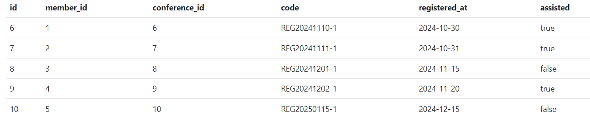

Events DLL y select

Crear tabla member: 

CREATE TABLE member(
id SERIAL,
fullname VARCHAR (100) NOT NULL,
email VARCHAR (200) NOT NULL,
age INT NOT NULL,
UNIQUE (email),
PRIMARY KEY (id)
);

Crear tabla event:

CREATE TABLE event(
id SERIAL,
start_date DATE NOT NULL,
end_date DATE NOT NULL,
total_attendees INT NOT NULL,
city VARCHAR (50) NOT NULL,
PRIMARY KEY (id)
);

Crear tabla conference:

CREATE TABLE conference(
id SERIAL,
title VARCHAR (100) NOT NULL,
speaker VARCHAR (100) NOT NULL,
hour TIME NOT NULL,
day DATE NOT NULL,
total_attendees INT NOT NULL,
event_id INT NOT NULL,
PRIMARY KEY (id),
FOREIGN KEY (event_id) REFERENCES event (id)
);

Crear tabla register:

CREATE TABLE register(
id SERIAL,
member_id INT NOT NULL,
conference_id INT NOT NULL,
code VARCHAR (20) NOT NULL,
registered_at DATE NOT NULL,
assisted BOOLEAN NOT NULL,
UNIQUE (code),
PRIMARY KEY (id),
FOREIGN KEY (member_id) REFERENCES member (id),
FOREIGN KEY (conference_id) REFERENCES conference (id)
);

Insertar valores a la tabla member:

INSERT INTO member (fullname, email, age) VALUES
('Pedro Fernández', 'pedro.fernandez@example.com', 28),
('Sofía Ramírez', 'sofia.ramirez@example.com', 34),
('Miguel Torres', 'miguel.torres@example.com', 26),
('Lucía Morales', 'lucia.morales@example.com', 30),
('Javier Jiménez', 'javier.jimenez@example.com', 37);

Insertar valores a la tabla event:

INSERT INTO event (start_date, end_date, total_attendees, city) VALUES
('2024-11-10', '2024-11-12', 180, 'Granada'),
('2024-12-01', '2024-12-03', 220, 'Málaga'),
('2025-01-15', '2025-01-17', 160, 'Zaragoza'),
('2025-02-05', '2025-02-07', 190, 'Vigo'),
('2025-03-20', '2025-03-22', 250, 'Murcia');

Insertar valores a la tabla conference:

INSERT INTO conference (title, speaker, hour, day, total_attendees, event_id) VALUES
('Tecnologías Emergentes', 'Elena Rodríguez', '10:00:00', '2024-11-10', 70, 6),
('Estrategias de Negocio', 'Pedro Fernández', '13:00:00', '2024-11-11', 80, 6),
('Transformación Digital', 'Miguel Torres', '09:00:00', '2024-12-01', 100, 7),
('Gestión de Proyectos', 'Sofía Ramírez', '11:00:00', '2024-12-02', 90, 7),
('Big Data y Análisis', 'Lucía Morales', '14:00:00', '2025-01-15', 110, 8);

Insertar valores a la tabla register:

INSERT INTO register (member_id, conference_id, code, registered_at, assisted) VALUES
(1, 6, 'REG20241110-1', '2024-10-30', true),
(2, 7, 'REG20241111-1', '2024-10-31', true),
(3, 8, 'REG20241201-1', '2024-11-15', false),
(4, 9, 'REG20241202-1', '2024-11-20', true),
(5, 10, 'REG20250115-1', '2024-12-15', false);

CONSULTAS

1) Los miembros que tengan más de 30 años de edad:
SELECT * FROM member
WHERE age>30
ORDER BY age DESC

2) Las conferencias que se realizaron dentro de un es completo:
SELECT * FROM conference
WHERE day BETWEEN '2024-06-01' AND '2024-07-01'
ORDER BY day DESC

3) Los eventos en los cuales han asistido menos de 200 personas:
SELECT * FROM event
WHERE total_attendees<200
ORDER BY total_attendees DESC

4) Un miembro asisió o no a la conferencia, filtrando el id del registro, id del miembro y si asistió o no:
SELECT id, member_id, assisted FROM register
WHERE assisted=true
ORDER BY id ASC

5) Un registro que se ha registrado el día 2024-06-01
SELECT * FROM register
WHERE registered_at='2024-06-01'
ORDER BY registered_at DESC
